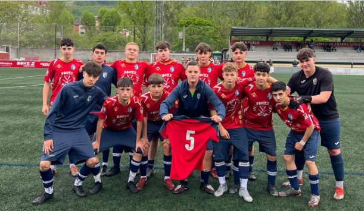

### 16/09 · Mis aficiones

LLevo jugando al futbol desde los 5 años, porque me gusta desde que soy pequeño.                                                                                                                                             Lo mas satisfactorio del futbol para mi es el progreso individual con el paso del tiempo                                                                                                                                       y cuando ganas en equipo y lo puedes disfrutar junto a ellos. Entreno los lunes, miércoles                                                                                                                                     
y viernes. También de vez en cuando me gusta jugar al pádel junto a mi padre y algún amigo                                                                                                                                  suyo.

Buscando en GitHub he encontrado [AntonRaichuk](https://github.com/google-research/football),
una pagina PARA SABER DE FUTBOL.

---
### 28/09· Premios Princesa de Asturias: Messi
Escogí a Messi ya que creo que es uno de los mejores futbolistas de la historia
y se merece ese premio. 
[Su pagina en la fundación](https://www.fpa.es/es/premios-princesa-de-asturias/premiados/2026-leo-messi/?texto=acta)
Aparte de lo deportivo como personas tiene unos valores muy buenos y se preocupa
por la gente que tienen una mala situación, por ultimo es una persona que influye 
mucho sobre los jovenes ya que es un referente para muchas personas.

![DESCRIPCIÓN CORTA]

